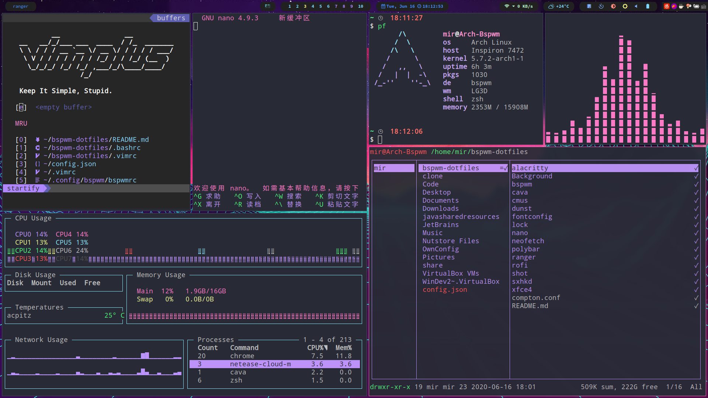

# My ArchLinux&Bspwm Config

只需要克隆这个repo，然后将文件夹放到相应的目录下

因为在Background目录下有很多我的壁纸文件，所以clone时间可能比较长



软件依赖：xterm或alacritty或xfce4-terminal, cava, dunst, nano, ranger, gotop, vim&vim-plus, pfetch, polybar, rofi, compton-tryone-git, i3lock, ffmpeg, feh, nerd-fonts-complete, zsh&oh-my-zsh

全局主题是Dracula

如果你已经有了自己的config文件，请做好备份

如果你只想要polybar的config文件，最好同时也使用compton-tryone-git来满足使用的blur效果

直接复制即可用的：

```bash
cp -r alacritty/ ~/.config/
```

```bash
cp -r dunst/ ~/.config/
```

```bash
cp -r cava/ ~/.config/
```

```bash
cp -r fontconfig/ ~/.config/
```

```bash
cp -r nano/ ~/.config/
```

```bash
cp -r neofetch/ ~/.config/
```

```bash
cp -r ranger/ ~/.config/
```

```bash
cp -r polybar/ ~/.config/
```

```bash
cp -r rofi/ ~/.config/
```

```bash
cp compton.conf ~/.config/
```

```bash
cp -r Background/ ~/Pictures/
```

需要一定配置的：

.vimrc：不建议直接拷贝 我使用的是[vim-plus](https://github.com/chxuan/vimplus)，关于Dracula主题请直接访问：[https://draculatheme.com/vim](https://draculatheme.com/vim)

.Xresource：不建议直接拷贝 我这个文件中的内容只包括基于x-window的应用的Dracula配置和xterm的配置

.zshrc：不建议直接拷贝 关于pfetch的alias可以照抄

xfce4文件夹：只使用xfce4-terminal的Dracula主题的话：

```bash
vim ~/.config/xfce4/teminal/terminalrc
```

将其中ColorPalette所在行修改为：

```
ColorPalette=#000000;#FF5555;#50FA7B;#F1FA8C;#BD93F9;#FF79C6;#8BE9FD;#BFBFBF;#4D4D4D;#FF6E67;#5AF78E;#F4F99D;#CAA9FA;#FF92D0;#9AEDFE;#E6E6E6
```

关于i3lock

```bash
sudo cp lock/lock.sh /usr/bin/lock && sudo cp lock/lock.png /bin/
```

并且在你的bspwmrc文件中添加下列行：

```bash
compton -b
$HOME/.config/polybar/launch.sh &
$HOME/Pictures/Background/auto-change.sh &
# autolock if no action of 10 minutes
# if you want to avoid it, just move your cursor to one of the corner of screen
xautolock -time 10 -locker '/usr/bin/lock' -corners ---- -cornersize 30 &
```

关于天气我使用的是[wttr.in](https://github.com/chubin/wttr.in)，所以最好在你的/etc/hosts文件中添加下列行来解决域名解析不正确的问题：


```bash
# wttr.in
5.9.243.187 wttr.in
```
