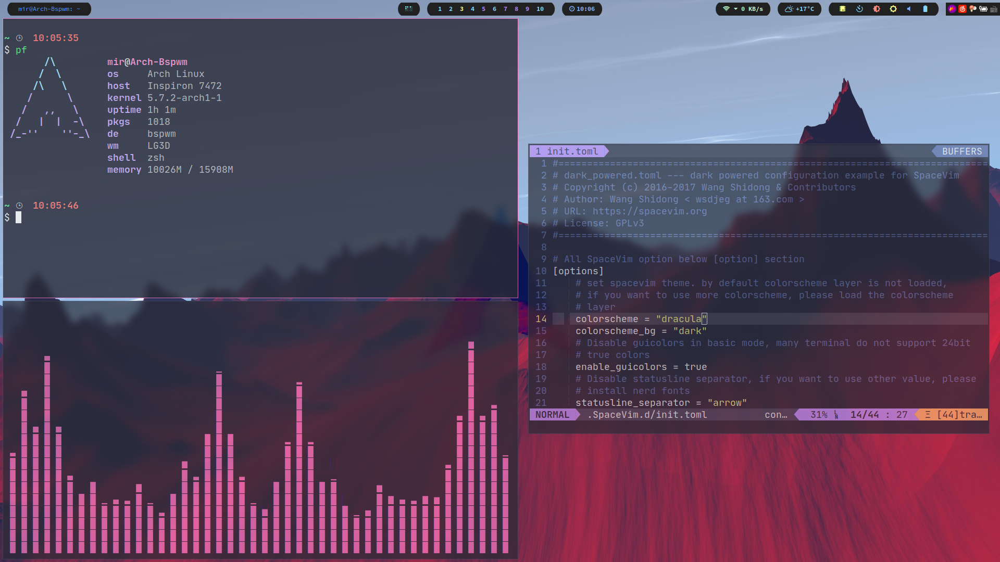

# My ArchLinux&Bspwm Config

Just clone it. And copy folders to corresponding directorys.

只需要克隆这个repo，然后将文件夹放到相应的目录下

There are many wallpapers in my Background folder, so the time of download may be a little long.

因为在Background目录下有很多我的壁纸文件，所以clone时间可能比较长




Dependency:xterm/alacritty, cava, dunst, polybar, rofi, compton-tryone-git, i3lock, ffmpeg, feh, nerd-fonts-complete

软件依赖：xterm或alacritty, cava, dunst, polybar, rofi, compton-tryone-git, i3lock, ffmpeg, feh, nerd-fonts-complete

The global theme: Dracula

全局主题是：Dracula

If you already have your own config files, please make a backup.

如果你已经有了自己的config文件，请做好备份

If you just want the config of polybar, you'd better use compton-tryone-git too.

如果你只想要polybar的config文件，最好同时也使用compton-tryone-git来满足使用的blur效果

```bash
cp -r alacritty/ ~/.config/
```

```bash
cp -r dunst/ ~/.config/
```

```bash
cp -r polybar/ ~/.config/
```

```bash
cp -r rofi/ ~/.config/
```

```bash
cp compton.conf ~/.config/
```

```bash
cp -r Background/ ~/Pictures/
```

```bash
sudo cp lock/lock.sh /usr/bin/lock && sudo cp lock/lock.png /bin/
```

Add the following lines to you bspwmrc:

并且在你的bspwmrc文件中添加下列行：

```bash
compton -b
$HOME/.config/polybar/launch.sh &
$HOME/Pictures/Background/auto-change.sh &
# autolock if no action of 10 minutes
# if you want to avoid it, just move your cursor to one of the corner of screen
xautolock -time 10 -locker '/usr/bin/lock' -corners ---- -cornersize 30 &
```

About the weather, I use [wttr.in](https://github.com/chubin/wttr.in), so you'd better add it to your /etc/hosts:

关于天气我使用的是[wttr.in](https://github.com/chubin/wttr.in)，所以最好在你的/etc/hosts文件中添加下列行来解决域名解析不正确的问题：


```bash
# wttr.in
5.9.243.187 wttr.in
```
