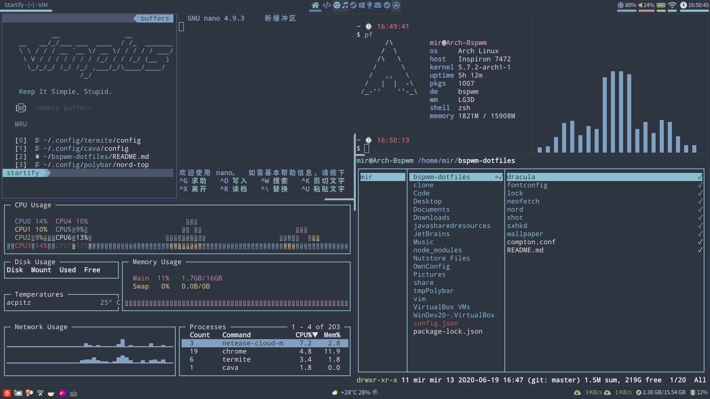

# My ArchLinux&Bspwm Config

Dracula:


Nord:




Terminal: Dracula: xterm Nord: termite

Audio output emulator: cava

Message notifier: dunst

Editor: vim(with vim-plus), nano

File browser: ranger

System monitor: gotop

System information: pfetch

Bar: polybar

Program start menu: rofi

Compton: compton-tryone-git

Lock: i3lock(with blur and a lock png) ffmpeg

Wallpaper: feh

Font: Droid Sans Mono Nerd Font:size=13 (nerd-fonts-complete needed)

Shell: zsh(with oh-my-zsh)

关于i3lock

```bash
sudo cp lock/lock.sh /usr/bin/lock && sudo cp lock/lock.png /bin/
```

并且在你的bspwmrc文件中添加下列行：

```bash
compton -b
$HOME/.config/polybar/launch.sh &
$HOME/Pictures/Background/auto-change.sh &
# autolock if no action of 10 minutes
# if you want to avoid it, just move your cursor to one of the corner of screen
xautolock -time 10 -locker '/usr/bin/lock' -corners ---- -cornersize 30 &
```

关于天气我使用的是[wttr.in](https://github.com/chubin/wttr.in)，所以最好在你的/etc/hosts文件中添加下列行来解决域名解析不正确的问题：


```bash
# wttr.in
5.9.243.187 wttr.in
```
