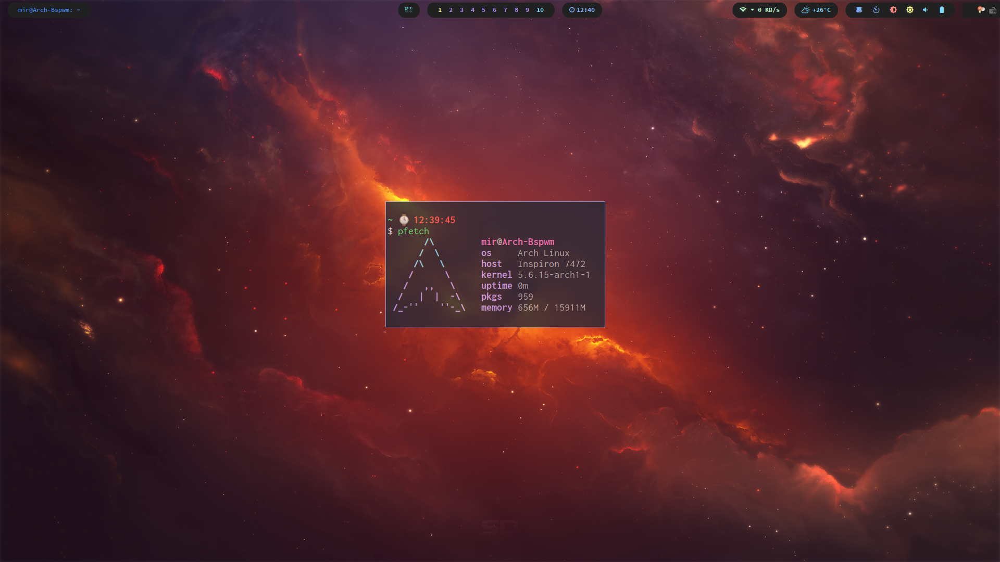

# My ArchLinux&Bspwm Config

Just clone it. And copy folder to corresponding directory.



Dependency: alacritty, dunst, polybar, rofi, compton-tryone-git, i3lock, ffmpeg, feh, nerd-fonts-complete

If you already have your own config files, please make a backup.

```bash
cp -r alacritty/ ~/.config/
```

```bash
cp -r dunst/ ~/.config/
```

```bash
cp -r polybar/ ~/.config/
```

```bash
cp -r rofi/ ~/.config/
```

```bash
cp compton.conf ~/.config/
```

```bash
cp -r Background/ ~/Pictures
```

```bash
sudo cp lock/lock.sh /usr/bin/lock && sudo cp lock/lock.png /bin/
```

Add the following lines to you bspwmrc:

```bash
compton -b --backend glx
$HOME/.config/polybar/launch.sh &
$HOME/Pictures/Background/auto-change.sh &
# autolock if no action of 10 minutes
# if you want to avoid it, just move your cursor to one of the corner of screen
xautolock -time 10 -locker '/usr/bin/lock' -corners ---- -cornersize 30 &
```

About the weather, I use wttr.in, so you'd better add it to your /etc/hosts:

```bash
# wttr.in
5.9.243.187 wttr.in
```

